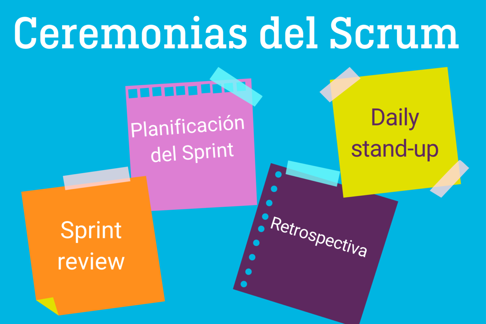
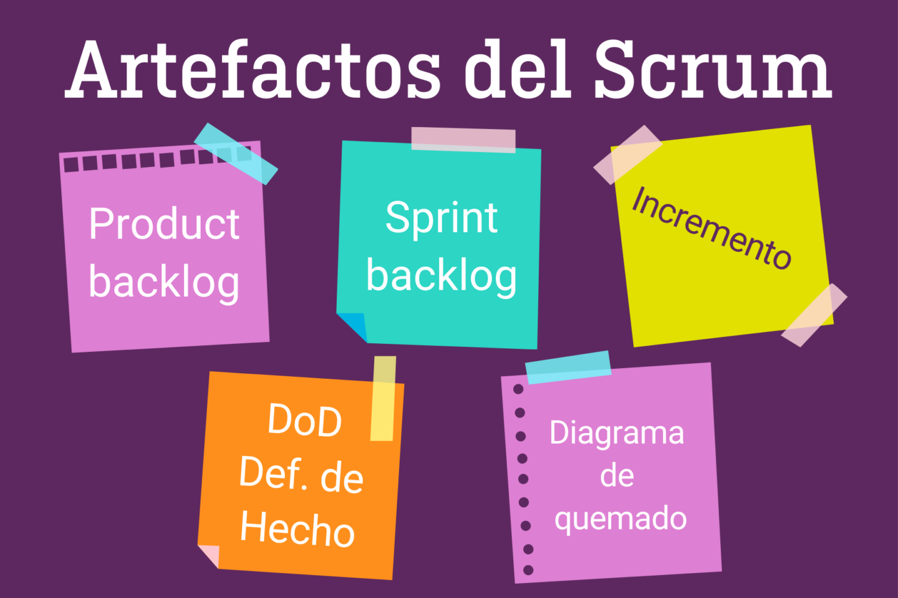
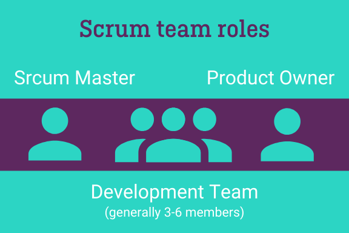

# Instituto Superior Politécnico Córdoba

---

## Ejercicios

Este es el repositorio destinado a los ejercicios de la Tecnicatura Superior en
Desarrollo Web y Aplicaciones Digitales.

## Tema SCRUM:

- Ceremonias
- Arfactos
- Roles

# ¿Cuáles son las ceremonias del Scrum?:

Las ceremonias del scrum, o los eventos del scrum, son una parte importante del progeso ágil de un proyecto. Las cuatro ceremonias principales son las reuniones que tienen lugar en las iteraciones o sprints, y que pretenden asegurar el rápido y constante progreso del equipo Scrum, a la par que mejora continuamente su forma de trabajar.

1. Planificación del Sprint o Sprint Planning
   La planificación del sprint, tiene lugar al comienzo de cada sprint. Para ello se reune al equipo scrum al completo, y los integrantes deben ponerse de acuerdo sobre el trabajo a realizar durante el sprint. El Product Owner selecciona y prioriza los elementos más importantes del Product Backlog, explicando cada uno de los elementos seleccionados y su importancia al equipo Scrum.

2. Reuniones Scrum Diarias o Daily Meetings
   El también conocido como Daily Stand-Up, requiere también de la presencia del equipo scrum al completo, se reunirán durante nunca más de 15 minutos. Se alienta al equipo a reunirse de pie, para que la reunión no tarde más de lo necesario. En este tipo de reunión se pretende informar de manera rápida al resto del equipo sobre el progreso de cada miembro del equipo. Cada persona debe de forma concisa y concreta responder las siguiente preguntas:

¿Qué hiciste ayer?
¿En qué trabajarás hoy?
¿Qué obstáculos han surgido?
Estas reuniones ayudan a incrementar la responsabilidad dentro del grupo scrum, a elevar la eficiencia, y el progreso del equipo. Además, mediante estas reuniones el Scrum Master, puede conocer las necesidades y los obstáculos a los que se enfrenta el equipo. Es importante que todos los miembros escuchen a los demás, y no desviarse del tema, ni sobrepasar el tiempo máximo.

3. Sprint review
   El Sprint Review, sucede al final de cada sprint, y requiere como las demás ceremonias, de la presencia de todo el equipo. La diferencia radica, en que a esta ceremonia, también pueden asistir otras partes interesadas. En esta ceremonia se comparte lo que se ha completado durante el sprint que justo ha terminado, esto se puede compartir con las otras partes interesadas (como puede ser el cliente o el usuario). Este momento es especialmente importante, para recibir retro-alimentación del cliente y del usuario, feedback, del que el Product Owner a su vez tomará nota, para incorporarlo en el Product Backlog (y así incoporarlo al siguiente sprint).

4. Retrospectiva
   La Retrospectiva del sprint, también tiene lugar al final de cada sprint. Los que asisten a esta ceremonía son: el equipo de desarrollo y el Scrum Master. El Product Owner puede atender, pero no es obligatorio. El foco de atención de esta ceremonía es revisar la forma de trabajo del equipo durante el sprint que acaba de finalizar. Así los miembros se dan feedback entre sí, e intentan conjuntamente pensar en soluciones para sobrepasar los obstáculos, y pensar en mejoras en cuanto a la forma de trabajar. La ceremonía Retrospectiva se debería celebrar siempre al final de cada sprint, aunque el sprint haya ido perfectamente y el equipo sea feliz, el sprint se debe celebrar.

# ¿Qué son los artefactos del Scrum? (Scrum Artifacts):

Los artefactos del Scrum, contienen la información más importante para el equipo Scrum, tanto para ellos, como para todas las partes interesadas. Hay 3 artefactos principales del Scrum: el backlog del producto o lista de producto, el backlog del sprint o lista de objetivos pendientes del sprint y el incremento. Hay otros artefactos que pueden usarse dentro del equipo scrum, pero a éstos no se les considera fundamentales, entre estos distinguimos los listados de los objetivos cumplidos y el burndown chart o diagrama de quemado scrum.

1. Product Backlog o Lista de Producto
   La Lista de Producto, rompe el producto en un listado dinámico de elementos obligatorios, entre los que se incluyen las características del producto, las mejoras del producto y los arreglos necesarios. El Producto Backlog se actualiza a menudo, para reflejar las últimas necesidades del mercado, o el feedback del cliente. El Product Backlog lo controla el Product Owner.

2. Sprint Backlog o Lista de Objetivos Pendientes del Sprint
   El Sprint Backlog toma en cuenta elementos específicos del Product Backlog, en los que se centerará el sprint actual. Es por así llamarlo, una imagen del trabajo real que se está realizando en el momento. Se trata de un artefacto flexible, que se adapta a las necesidades, cambiando el orden del trabajo, quitando las tareas innecesarias, y agregando las que sean necesarias. Este listado lo supervisa el Scrum Master, y el Product Owner puede ayudarle a elaborarlo, finalmente es el equipo de desarrollo quien controla el listado.

3. Incremento
   El incremento es el incremento del producto. Por ejemplo: una pieza que funciona del software que se está desarrollando, que representa a su vez un conjunto de elementos completados del backlog del producto. Debe estar alineado con la definición de hecho o DoD, y también debe ser aceptado por el product owner, quien decide si se lanzará.

4. Definición de Hecho ó DoD
   La definición de hecho, la decide y define el equipo, y será aplicado a todos los elementos del producto y del product backlog. Es un listado de criterios, que determinarán cuando a un elemento se le define como terminado 100%. Esta definición ayuda a obligar a un mínimo de calidad, calidad necesaria para la viabilidad del producto, lo que hará que el equipo no gaste tiempo de más en un sólo elemento.

5. Burndown chart o Diagrama de Quemado
   El diagrama de quemado se usa para medir el progreso general de un proyecto. Da una visión a largo plazo del trabajo terminado y del trabajo por realizar. Mide la velocidad, y compara con el trabajo estimado con el trabajo realmente realizado, dando un aporte de realismo al equipo.

# Un equipo Scrum siempre se compone de: (Roles)

- Un Product Owner (PO);
- Un Scrum Master (SM);
- Un equipo de desarrollo

Los equipos scrum son auto-gestionados y multidisciplinarios. Esto significa, que como equipo, ellos mismos deciden cual es el mejor camino a seguir, nadie de fuera del equipo decide sobre los pasos a seguir. Además, los equipos scrum poseen ellos mismos todas las habilidades necesarias para llevar a cabo su trabajo, sin necesidad de la intervención de un agente externo. Un equipo que ha alcanzado la madurez en scrum, se fundamenta en su abilidad organizativa, son capaces de auto-organizarse en todos los aspectos, tanto los técnicos como los funcionales.

- Product Owner
  El product owner es el responsable de clientes y usuarios del proyecto. Hay un PO por cada equipo Scrum. El PO es el encargado de mantener y gestionar el backlog del producto, que incluye los elementos del backlog ordenados por prioridad. Elementos del backlog pueden ser: user stories o elementos a desarrollar. En otras palabras, el PO es el responsable del éxito del producto.

De acuerdo con el Manual de Scrum "El Backlog del Producto debe":

- Definir claramente y de forma precisa los elementos del backlog del producto .
- Los elementos del backlog deben estar ordenados para asegurar cumplir los objetivos.
- Optimizar el valor del trabajo que lleva a cabo el equipo de desarrolladores.
- Ser visible, transparente y estar al alcance de todo el equipo Scrum.
- Ser comprensible para el equipo de desarrolladores.
  El Product Owner debe tener una visión y comprensión muy clara del producto, debe conocer bien el producto, y en que debe evolucionar, asegurando que satisfacerá las necesidades de los clientes. Define la hoja de ruta del producto.

Idealmente, el product owner (a veces también llamado product manager) forma parte íntegra del equipo, es decir, trabaja en el mismo espacio/oficina. El éxito del PO depende en gran medida del respeto de la organización hacia su función.

- Scrum Master
  El rol del Scrum Master (SM), no es el de un líder que dirige a su equipo, si no el de un acompañante. En la metodología Scrum no hay jerarquía. Al gestionar el progreso de un proyecto, el SM se asegura que todos los miembros del equipo están involucrados y saben perfectamente como auto-organizar su trabajo.

Un buen Scrum Master se caracteriza por su empatía, diplomacia y humildad, mediante los que ágilmente resuelve problemas. Además también tienen habilidades de enseñanza (los cuales deben continuamente seguir desarrollando), para poder enseñar a su equipo.

Un equipo trabajando juntos bajo la metodología Scrum debe estar unido. Y está en las manos del SM crear esa harmonía de equipo necesaria, para trabajar unidos. Aseguran una fuerte cohesión de equipo, tal y como indica el Manual Scrum:

- Asesoran al equipo de desarrollo para que estos sean auto-gestionados y cross-funcionales.
- Ayudan al equipo de desarrollo en la creación de productos de alto valor.
- Eliminan los obstáculos que puedan aparecer durante el progreso durante el trabajo del equipo de desarrollo.
- Facilitan los eventos Scrum.
- Realizan coaching al equipo de desarrollo en ambientes organizativos en los que aún no se haya adoptado al 100% la metodología scrum.

El Scrum Master también sirve de enlace entre el product owner y el equipo del cliente. El Scrum Master le indica al equipo los cambios o nuevas opciones que requiera el cliente. Otras responsabilidad del SM, de acuerdo con el Manual Scrum, son:

- Asegurar la comprensión de los objetivos, el alcance del proyecto y el concepto del producto por parte del equipo.
- Encontrar técnicas que aseguren el correcto funcionamiento de la gestión del backlog.
- Ayudar al equipo scrum, con la identificación de elementos claros y concisos necesarios del backlog.
- Comprensión de la planificación del producto en entornos empíricos.
- Comprender y poner en marcha acciones de agilidad.
- Facilitar la celebración de eventos scrum.

Es importante recordar, que la función primordial del Scrum Master, consiste en asegurar la harmonía del equipo. El SM cubre multitud de funciones y responsabilidades, pero en ningún caso es un project manager o asistente de organización. Las siguientes cualidades humanas son importantes que las posea un Scrum Master:

- Liderar el coaching de la implementación de scrum en la empresa.
- Planificar la ejecución de acciones scrum.
- Ayudar a los empleados y a las partes interesadas, a entender y promulgar el scum en el desarrollo del productos.
- Favorecer el cambio que ayude a incrementar la productividad del equipo scrum.
- Trabajar conjuntamente con otros Scrum Masters para mejorar su eficiencia en la aplicación del scrum dentro de la empresa.

* Equipo de Desarrollo (Development Team)

  La cantidad de miembros por la que está compuesto el equipo de desarrollo puede variar. Ya que cada proyecto debe ser autosuficiente, las habilidades de los miembros del equipo deben abarcar todos los mayores aspectos y necesidades. En proyectos de IT, los miembros del equipo tradicionalmente son desarrolladores, ya que desarrollan software. Pero, hoy en día, el Scrum se usa en todo tipo de proyectos, por lo que "desarrolladores" puede abarcar muchos tipos de roles.

Las siguientes afirmaciones deben cumplirse en un equipo de desarrollo:

- Auto-organizados. Nadie, ni siquiera el Scrum Master le dice al equipo de desarrollo cómo convertir el backlog del producto en incrementos de funcionalidades del proyecto.
- Son cross-funcionales, entre todos poseen todas las habilidades necesarias para crear el producto.
- Dentro del equipo de desarrollo no existen los títulos.
- No existen sub-equipos dentro del equipo de desarrollo, independientemente de los distintos ámbitos de trabajo a realizar.
- Los distintos miembros del equipo de desarrollo tendrán distintas especialidades, pero responden como un equipo.

Como norma general, "cuantos menos mejor". Esta norma facilita la simplicidad a la hora de entregar un producto. Aunque hay que tener en cuenta, que aunque menos sea mejor, es necesario que el equipo esté conformado por el número necesario de miembros, para que el equipo posea todas las habilidades necesarias en el desarrollo del producto. Ni al product owner, ni al scrum master se les cuenta como miembros del equipo de desarrollo.

En cuanto a la descripción del puesto, en el caso de un oferta de empleo, las habilidades que se suelen pedir son muy diversas, ya que a los "desarrolladores" se les contrata en función de sus habilidades. Siempre será una ventaja la experiencia de trabajo en equipos scrum.
